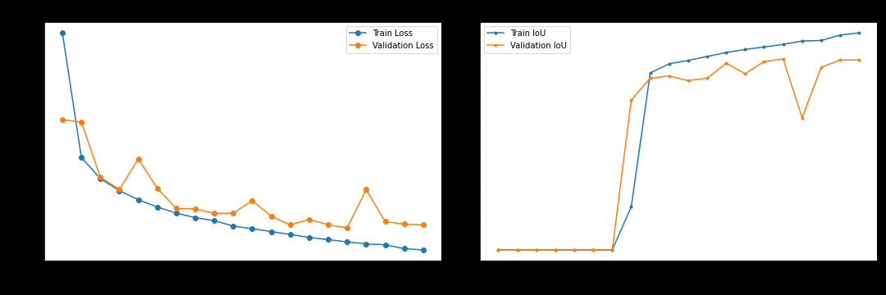
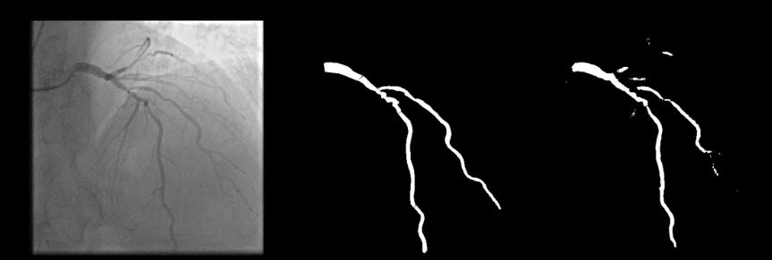
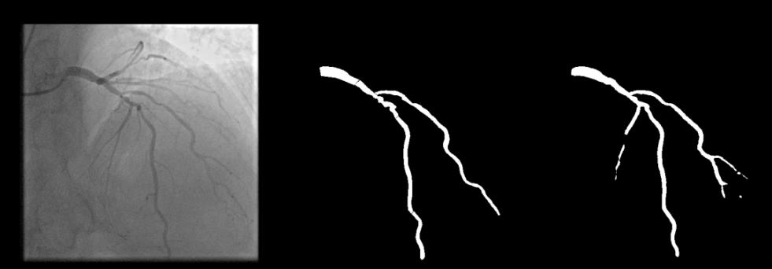
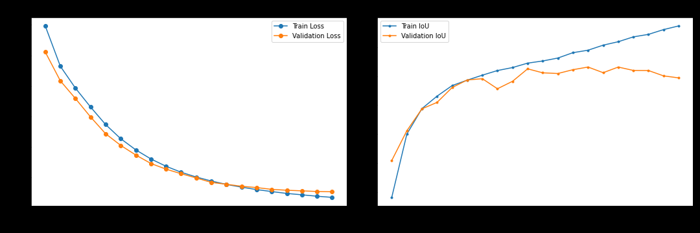
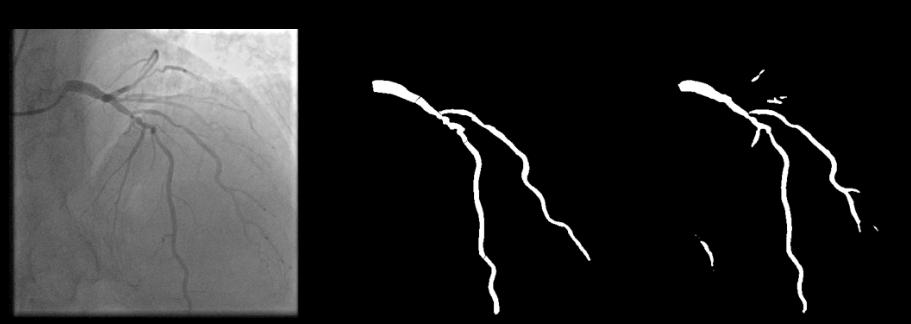
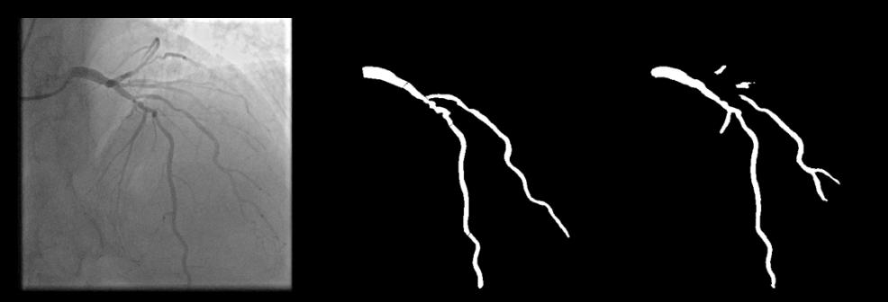

# U-Net segmentation of coronary vessel trees (ARCADE)

Semantic segmentation of the **coronary vessel tree** from X-ray coronary angiography (XCA) using a **U-Net** trained on the **ARCADE** dataset. This repository accompanies the project report [`u1527246 - Project Report.pdf`](u1527246%20-%20Project%20Report.pdf).

## Motivation

Coronary artery disease (CAD) is a major cause of death and disability worldwide. XCA is a standard way to visualize coronary arteries; automating vessel-tree segmentation can support diagnosis and workflow. This project treats segmentation as **binary mask prediction** (foreground vessel tree vs. background), merging all annotated regions into a single mask rather than 26-way regional labels.

## Problem statement

Train a deep learning model that segments the **full coronary vessel tree** in XCA images as a binary mask, improving overlap with ground truth and producing visually coherent vessel predictions under class imbalance (thin vessels vs. large background).

## Dataset

- **ARCADE** — [Automatic Region-based Coronary Artery Disease Diagnostics using X-ray Angiography Images](https://zenodo.org/records/8386059).
- **Images:** 1200 XCA images with COCO-style annotations (originally 26 regions); here, masks are **combined into one binary vessel mask** per image.
- **Split:** 1000 training / 200 validation images.
- **On disk:** images and COCO annotations should follow the layout expected by [`dataset.py`](dataset.py) (COCO API + image folder). The report uses a `dataset_phase_1/segmentation_dataset/` style layout with `seg_train` and `seg_val`; adjust paths in the notebooks to match your local copy.

## Model

Implementation: [`baseline_model.py`](baseline_model.py).

- **U-Net** (Ronneberger et al., MICCAI 2015): encoder–decoder with **skip connections**.
- **Encoder:** repeated *max pool + double conv* (channels **16 → 32 → 64 → 128 → 256**).
- **Decoder:** *transposed convolution* upsampling + concatenation with encoder features + double conv.
- **Head:** `1×1` convolution → **1 channel** logits for binary segmentation.
- **Blocks:** each “double conv” is conv–BN–ReLU ×2.

## Training setup

| Setting | Value |
|--------|--------|
| Input size | **512 × 512**, RGB (3 channels) |
| Epochs | **20** |
| LR schedule | **ReduceLROnPlateau** (factor **0.5**, patience **3**, on validation loss) |
| Metric | **Mean IoU** (foreground) |
| Checkpointing | Best weights by **validation loss** |

**Optimizers and hyperparameters**

| Optimizer | Learning rate | Weight decay | Momentum |
|-----------|---------------|--------------|----------|
| Adam | `1e-4` | `1e-5` | — |
| SGD | `1e-2` | `1e-4` | `0.9` |

**Loss functions**

- **Binary cross-entropy (BCE)** on pixel logits.
- **Dice loss** (generalized Dice / overlap-based loss; Sudre et al., DLMIA 2017) to mitigate **class imbalance** and emphasize overlap on thin structures.

Experiments: **2 losses × 2 optimizers = 4 runs**, with manual seeding for reproducibility (see report).

## Results

**Mean IoU** on train and validation (from the project report):

| Loss | Optimizer | Train mIoU | Val mIoU |
|------|-----------|------------|----------|
| BCE | SGD | 0.64 | **0.59** |
| Dice | SGD | 0.75 | **0.64** |
| BCE | Adam | **0.77** | 0.63 |
| Dice | Adam | 0.76 | **0.64** |

**Takeaways**

- **Dice loss** achieves the **best validation mIoU (0.64)** for both SGD and Adam; it tends to produce **more continuous, detailed** vessel masks than BCE.
- With **SGD**, BCE underperforms Dice by a large margin on validation (0.59 vs. 0.64); BCE masks are **more fragmented** along thin vessels.
- With **Adam**, BCE reaches higher **train** mIoU but slightly **lower validation** mIoU than Dice; qualitatively, **BCE shows more false-positive mask** compared to Dice in the report’s examples.

### Visual results

Figures below are **exported from** [`u1527246 - Project Report.pdf`](u1527246%20-%20Project%20Report.pdf) (same content as Figures 1.x–3.x in the report). Full-resolution copies live in [`visualizations/readme_figures/`](visualizations/readme_figures/).

**Dataset sample** (input angiogram, combined binary mask, overlay)


**SGD + BCE** — training loss and mean IoU vs. epoch (report Fig. 2.1)



**SGD + BCE** — example prediction (report Fig. 2.2)



**SGD + Dice** — Dice loss, Dice coefficient, mean IoU (report Fig. 2.3)


**SGD + Dice** — example prediction (report Fig. 2.4)



**Adam + BCE** — loss and mean IoU (report Fig. 3.1)



**Adam + BCE** — example prediction (report Fig. 3.2)



**Adam + Dice** — Dice loss, Dice coefficient, mean IoU (report Fig. 3.3)


**Adam + Dice** — example prediction (report Fig. 3.4)



You can regenerate plots from the training notebooks; any newly saved runs can go under `visualizations/` alongside these exports.

## Repository layout

```
.
├── baseline_model.py          # U-Net (DoubleConv, Down, Up, UNet)
├── dataset.py                 # COCOSegmentationDataset (combined binary masks)
├── Bceloss.ipynb              # Train / eval with BCE loss
├── Dice loss.ipynb            # Train / eval with Dice loss
├── models/                    # Saved checkpoints (per experiment)
├── visualizations/
│   └── readme_figures/        # Figures embedded in this README (from the PDF report)
├── u1527246 - Project Report.pdf
└── README.md
```

Place your **ARCADE** train/val images and COCO JSON where the notebooks expect them (paths are set inside each notebook).

**Dependencies (from code):** Python 3, PyTorch, torchvision, Pillow, NumPy, Matplotlib, **pycocotools**.

## Future work (from report)

- Multiclass segmentation (e.g., vessel types / regions) for richer clinical cues.
- Stronger **data augmentation** and ablation on mIoU.
- Other segmentation backbones vs. this U-Net.
- Train on **single-channel grayscale** inputs to reduce redundancy and compute.

## References

1. ARCADE dataset — [Zenodo record 8386059](https://zenodo.org/records/8386059).  
2. O. Ronneberger, P. Fischer, T. Brox, “U-Net: Convolutional Networks for Biomedical Image Segmentation,” MICCAI 2015.  
3. C. Sudre et al., “Generalised dice overlap as a deep learning loss function for highly unbalanced segmentations,” DLMIA / MICCAI workshops, 2017.
