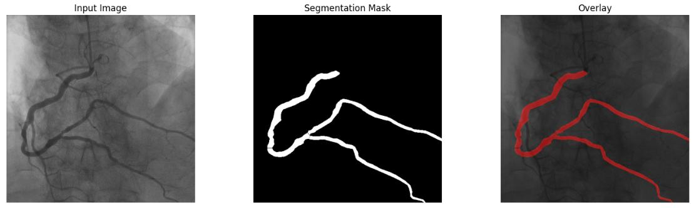
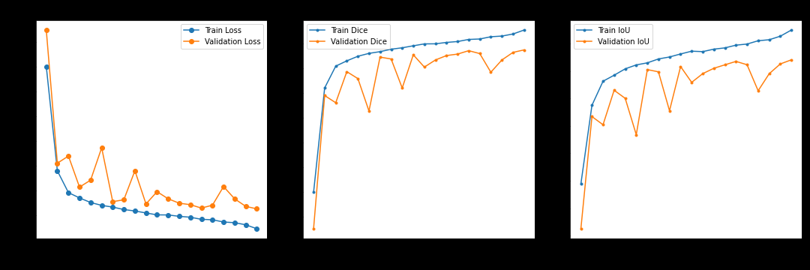
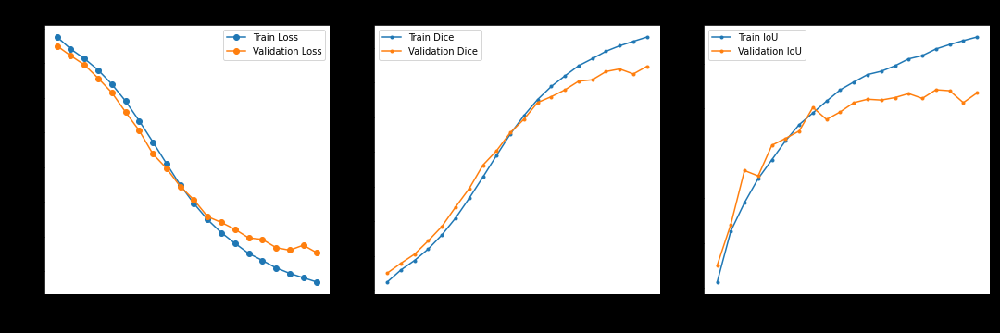

# U-Net segmentation of coronary vessel trees (ARCADE)

U-Net **binary segmentation** of the coronary vessel tree on X-ray coronary angiography (XCA), trained on **ARCADE**. Project report: [`u1527246 - Project Report.pdf`](u1527246%20-%20Project%20Report.pdf).

## Problem statement

This work segments the full coronary vessel tree in XCA images as a **single foreground mask** by merging all ARCADE annotations into one binary label, addressing heavy foreground/background imbalance while supporting CAD-related imaging analysis. A **U-Net** is trained with **BCE** and/or **Dice** loss under **SGD** and **Adam**, and performance is reported with **mean IoU** (see Results).

## Dataset

- **ARCADE** — [Automatic Region-based Coronary Artery Disease Diagnostics using X-ray Angiography Images](https://zenodo.org/records/8386059).
- **Images:** 1200 XCA images with COCO-style annotations (originally 26 regions); here, masks are **combined into one binary vessel mask** per image.
- **Split:** 1000 training / 200 validation images.
- **On disk:** images and COCO annotations should follow the layout expected by [`dataset.py`](dataset.py) (COCO API + image folder). The report uses a `dataset_phase_1/segmentation_dataset/` style layout with `seg_train` and `seg_val`; adjust paths in the notebooks to match your local copy.

## Model

Implementation: [`baseline_model.py`](baseline_model.py).

- **U-Net** (Ronneberger et al., MICCAI 2015): encoder–decoder with **skip connections**.
- **Encoder:** repeated *max pool + double conv* (channels **16 → 32 → 64 → 128 → 256**).
- **Decoder:** *transposed convolution* upsampling + concatenation with encoder features + double conv.
- **Head:** `1×1` convolution → **1 channel** logits for binary segmentation.
- **Blocks:** each “double conv” is conv–BN–ReLU ×2.

## Training setup

| Setting | Value |
|--------|--------|
| Input size | **512 × 512**, RGB (3 channels) |
| Epochs | **20** |
| LR schedule | **ReduceLROnPlateau** (factor **0.5**, patience **3**, on validation loss) |
| Metric | **Mean IoU** (foreground) |
| Checkpointing | Best weights by **validation loss** |

**Optimizers and hyperparameters**

| Optimizer | Learning rate | Weight decay | Momentum |
|-----------|---------------|--------------|----------|
| Adam | `1e-4` | `1e-5` | — |
| SGD | `1e-2` | `1e-4` | `0.9` |

**Loss functions**

- **Binary cross-entropy (BCE)** on pixel logits.
- **Dice loss** (generalized Dice / overlap-based loss; Sudre et al., DLMIA 2017) to mitigate **class imbalance** and emphasize overlap on thin structures.

Experiments: **2 losses × 2 optimizers = 4 runs**, with manual seeding for reproducibility (see report).

## Results

**Mean IoU** on train and validation (from the project report):

| Loss | Optimizer | Train mIoU | Val mIoU |
|------|-----------|------------|----------|
| BCE | SGD | 0.64 | **0.59** |
| Dice | SGD | 0.75 | **0.64** |
| BCE | Adam | **0.77** | 0.63 |
| Dice | Adam | 0.76 | **0.64** |

**Takeaways**

- **Dice loss** achieves the **best validation mIoU (0.64)** for both SGD and Adam; it tends to produce **more continuous, detailed** vessel masks than BCE.
- With **SGD**, BCE underperforms Dice by a large margin on validation (0.59 vs. 0.64); BCE masks are **more fragmented** along thin vessels.
- With **Adam**, BCE reaches higher **train** mIoU but slightly **lower validation** mIoU than Dice; qualitatively, **BCE shows more false-positive mask** compared to Dice in the report’s examples.

### Visual results

Exported from the project PDF; source files in [`visualizations/readme_figures/`](visualizations/readme_figures/).

**1. Dataset sample** (input angiogram, combined binary mask, overlay)



**2. SGD + Dice** — Dice loss, Dice coefficient, mean IoU (Fig. 2.3)



**3. Adam + Dice** — Dice loss, Dice coefficient, mean IoU (Fig. 3.3)



## Repository layout

```
.
├── baseline_model.py          # U-Net (DoubleConv, Down, Up, UNet)
├── dataset.py                 # COCOSegmentationDataset (combined binary masks)
├── Bceloss.ipynb              # Train / eval with BCE loss
├── Dice loss.ipynb            # Train / eval with Dice loss
├── models/                    # Saved checkpoints (per experiment)
├── visualizations/
│   └── readme_figures/        # Figures embedded in this README (from the PDF report)
├── u1527246 - Project Report.pdf
└── README.md
```

Place your **ARCADE** train/val images and COCO JSON where the notebooks expect them (paths are set inside each notebook).

**Dependencies (from code):** Python 3, PyTorch, torchvision, Pillow, NumPy, Matplotlib, **pycocotools**.

## References

1. ARCADE dataset — [Zenodo record 8386059](https://zenodo.org/records/8386059).  
2. O. Ronneberger, P. Fischer, T. Brox, “U-Net: Convolutional Networks for Biomedical Image Segmentation,” MICCAI 2015.  
3. C. Sudre et al., “Generalised dice overlap as a deep learning loss function for highly unbalanced segmentations,” DLMIA / MICCAI workshops, 2017.
